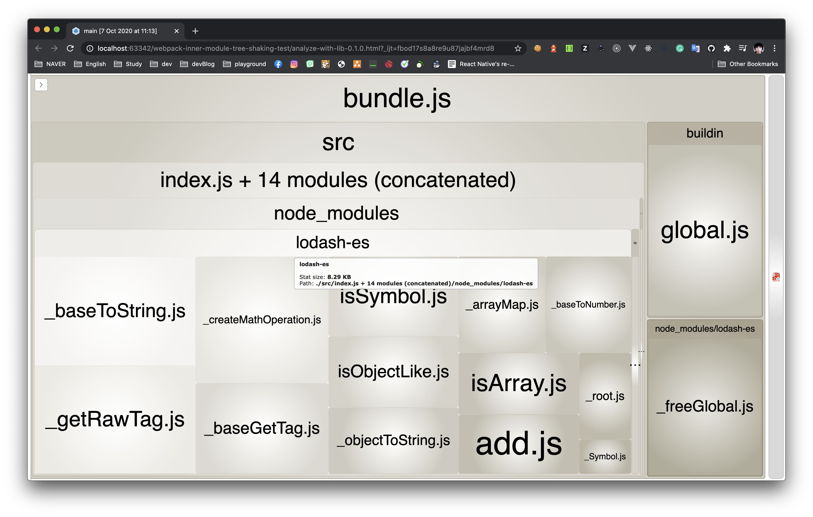
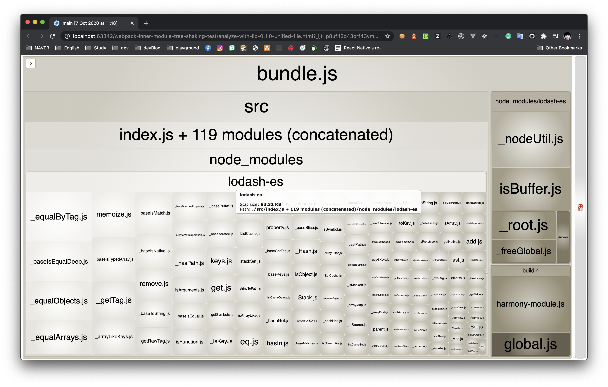
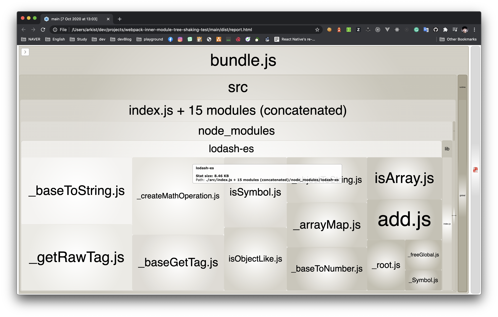

# Webpack inner-module tree-shaking test


[Webpack]은 참조 모듈이 ES module 문법을 사용할 경우 [Tree Shaking]을 통해 사용하지 않는 코드를 번들에서 제거해서 전체 사이즈를 줄일 수 있도록 해준다.

> `sideEffects` 등 설정이 필요하다. [Tree Shaking] 링크 참조. 

하지만 참조 모듈의 import 구문까지는 분석해주지 않는다.
사용하지 않는 *모든* 코드를 제거해주지는 않는다는 이야기이다.

잘 와닿지 않는다면 아래의 예를 보자. 

```js
// lib/index.js
import { add, remove } from 'lodash-es'
export const wrappedAdd = () => add
export const wrappedRemove = () => remove
```  
```js
// main/index.js (entry)
import { wrappedAdd } from 'lib'
console.log(wrappedAdd(2, 3))
```
이 경우 `main`을 번들링했을 경우 `lib`-`wrappedAdd`-`lodash.add`순으로 의존성을 추적해서 번들링 할 것을 기대할 것이다. 

하지만 실상은 `lib`에서 import 된 `remove`가 외부에서 참조되지 않는 `wrappedRemove`에서만 사용되고 있으며, 번들에서 제거 가능하다는 것을
웹팩이 인지하지 못한다.  
따라서 최종 번들에는 `lodash.remove`와 그 참조 모듈들까지 번들링이 된다.

관련이슈: https://github.com/webpack/webpack/issues/11194

이는 외부 모듈로 참조되는 라이브러리의 경우 특히 더 문제가 될 수 있다.  
사용자는 라이브러리의 일부만 사용하고 싶은데 웹팩에서 제공하는 문서를 따랐는데도 불필요한 부분까지 함께 번들링이 되고, 
그 원인조차 제대로 분석하기 힘들다.  
위의 관련이슈의 어떤이의 불만대로, 이것은 명백히 웹팩4의 문서화되지 않은 오동작이다.

이 문제를 해결하려면 파일 수준에서 모듈이 분리되어 있어야 한다.
파일 수준으로 모듈이 분리되어 있다면 참조되지 않는 출처(import from 'xxx')는 제거되어 기대한대로
사용한 모듈들만 번들링이 되며, [lodash-es]등 ES모듈의 형태로 tree shaking을 지원하는 라이브러리의 경우
대채로 이 구조를 많이 사용한다.

하지만 일일히 참조모듈을 신경쓰면서 파일을 쪼개는 것은 번거롭고 실수를 만들기도 쉽다.  
다행히 Webpack@5에서는 이를 해결하였다.  
https://github.com/webpack/changelog-v5#inner-module-tree-shaking

본 저장소는 해당 내용에 대해 실제 코드와 번들분석을 통해 알아보려고 한다.

## 프로젝트 구성

```
root/
  lib/  # main에서 참조하는 라이브러리 
  main/  # 실제 번들링이 일어나는 프로젝트. 외부모듈을 참조하거나 하기도 한다
    index.js  # 여기가 진입점
    inner.js  # index.js에서 참조. 외부모듈을 참조한다
    webpack.config.js  # 웹팩설정. 따로 수정할 부분은 없다
  lib-*.tgz  # 위의 lib을 `npm pack` 명령으로 패키징 한 배포본
  reports/analyze-*.html  # 번들링 결과에 대한 분석결과
```

## 번들링 테스트

총 여섯가지의 테스트를 진행했다. 본 저장소의 커밋내역별로 구성을 확인할 수 있다.

### 외부 모듈 w/Webpack@4

`lib`에서 모듈별로 별도의 파일로 구성하고 `main`에서는 `wrappedAdd`만 참조했다.
```js
// lib/index.js
export { wrappedAdd } from './wrappedAdd'
export { wrappedRemove } from './wrappedRemove'
``` 
```js
// lib/wrappedAdd.js
import { add } from 'lodash-es'
export const wrappedAdd = () => add
``` 
```js
// lib/wrappedRemove.js
import { remove } from 'lodash-es'
export const wrappedRemove = () => remove
``` 
```js
// main/index.js
import { wrappedAdd } from 'lib'
console.log(wrappedAdd(3, 4))
``` 

번들 분석 결과: [reports/analyze-lib.html](reports/analyze-lib.html)

lodash-es에서 `add`와 관련 모듈들만 포함된 것을 확인할 수 있다.


### 단일 파일 구성의 외부/내부 모듈 w/Webpack@4

`lib`을 하나의 파일로 구성하고, `main`에서는 마찬가지로 `wrappedAdd`만 참조했다.
```js
// lib/index.js
import { add, remove } from 'lodash-es'
export const wrappedAdd = () => add
export const wrappedRemove = () => remove
``` 
```js
// main/index.js
import { wrappedAdd } from 'lib'
console.log(wrappedAdd(3, 4))
``` 

번들 분석 결과: [reports/analyze-lib-unified-file.html](reports/analyze-lib-unified-file.html)

lodash-es에서 실제 참조하지 않은 `remove`와 관련 모듈들까지 포함된 것을 확인할 수 있다.


이는 내부 모듈로 구성한 경우도 동일하다: [reports/analyze-inner-module-unified-file.html](reports/analyze-inner-module-unified-file.html)


### 단일 파일 구성 w/Webpack@5

위와 동일하게 구성하고 웹팩만 (아직 RC인) 5로 올려주었다.

번들 분석 결과: [reports/analyze-with-webpack@5.html](reports/analyze-with-webpack@5.html)

모듈별로 파일을 분리해주었을 때처럼 실제 사용하는 `add` 모듈만 번들링 된 것을 확인할 수 있다.


### 그 외 

최근엔 웹팩 외에도 `zero-configuration`를 강점으로 내세우는 [microbundle]나, 
Go로 구현해서 엄청난 속도를 자랑하는 (진짜 어이없게 빠르다) [esbuild] 같은 번들러들이 등장했다. 

이들로도 한번 테스트를 해 보았다.  
결과는? 모두 기대했던대로 사용되는 모듈들만 번들링.

* esbuild 번들 분석결과: [reports/analyze-with-esbuild.html](reports/analyze-with-esbuild.html)
* microbundle 번들 분석결과: [reports/analyze-with-microbundle.html](reports/analyze-with-microbundle.html)


## 결론

최신의 Webpack@5나 microbundle, esbuild 등에서는 기대대로 Tree Shaking이 작동하는 것을 확인했다.

하지만 외부에 제공하는 라이브러리를 제공하는 입장에서는 여전히 당분간은 파일단위로 모듈을 제공할 수 밖에 없다.  
라이브러리 사용자가 실제 어플리케이션을 번들링 할 때 어떤 도구를 쓸지 알 수 없기 때문이다.

Webpack@4 기반으로 작동하는 레거시 프로젝트를 유지보수하는 입장도 마찬가지다.  
번들러가 해주는 일이 많아지면서 어플리케이션 구성에 중심적인 역할을 하게 되었고, 
복잡한 설정속에서 사이드이펙트를 감히 상상도 할 수 없게 되었다. 
   
라이브러리 제공자는 당분간 보수적으로 모듈을 구성하고,
Webpack@4 기반으로 어플리케이션을 구성한 경우에는 [Webpack@5 마이그레이션 가이드]를 참고하며  
다가올 새로운 시대를 위한 준비를 해 보도록 하자.


 

[Webpack]: https://webpack.js.org/
[Tree Shaking]: https://webpack.js.org/guides/tree-shaking/ 
[lodash-es]: https://www.npmjs.com/package/lodash-es/
[microbundle]: https://www.npmjs.com/package/microbundle/
[esbuild]: https://github.com/evanw/esbuild/
[Webpack@5 마이그레이션 가이드]: https://webpack.js.org/migrate/5/